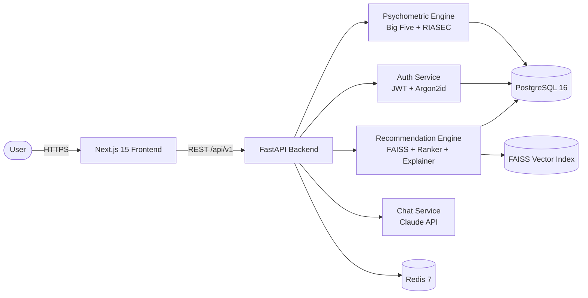

<div align="center">

# Career Intelligence Platform

**AI-powered career guidance built on psychometric science, not guesswork.**

[](./LICENSE)
[](https://github.com/abinaze/career-intelligence-platform/actions)
[](./apps/backend)
[](./apps/frontend)

[Documentation](./docs) · [Architecture](./docs/architecture/overview.md) · [API Reference](./docs/api/reference.md) · [Contributing](./CONTRIBUTING.md) · [Roadmap](./docs/ROADMAP.md)

</div>

---

## What this is

Most "career guidance" tools ask you to pick keywords and match them against job titles. This platform takes a different approach: it profiles you psychometrically — personality traits, vocational interests, cognitive style — and uses that profile to rank career paths by genuine compatibility, with a transparent, factor-by-factor explanation for every recommendation.

It is a full-stack, production-structured monorepo: a FastAPI backend with a real psychometric scoring engine and a FAISS-based recommendation system, and a Next.js frontend with an interactive assessment flow, an explainable careers dashboard, and an AI career counsellor chat grounded in the user's own profile.

Everything here runs on free and open-source infrastructure. No paid APIs are required for the core product, and no proprietary SaaS is baked into the architecture.

## Why it's built this way

Career guidance is a domain where a wrong recommendation has real cost — a semester in the wrong major, a career pivot that doesn't fit. That called for a system that:

- **Scores, rather than assumes.** Big Five personality and RIASEC vocational interest dimensions are computed from a real assessment engine, not a static quiz result page.
- **Explains itself.** Every recommendation ships with a confidence band and a decomposed breakdown of *why* — semantic profile match, interest alignment, salary context, market outlook — instead of a black-box score.
- **Respects the person behind the data.** See the [Privacy & Data Ownership](#privacy--data-ownership) section below — this is an active area of the roadmap, not an afterthought.

## Features

| Area | What's built |
|---|---|
| **Authentication** | JWT (HS256) access + refresh tokens, Argon2id password hashing, role-based access control |
| **Psychometric Assessment** | Interactive multi-step assessment UI, Big Five + RIASEC scoring engine, radar-chart results |
| **Recommendation Engine** | Sentence-transformer embeddings, FAISS similarity search, multi-factor weighted re-ranking |
| **Explainability** | Per-factor score breakdown, confidence bands, and a plain-language summary for every recommendation |
| **Career Data** | O*NET occupational taxonomy integration with salary and outlook data |
| **AI Career Chat** | Conversational counsellor grounded in the user's own psychometric profile (via Claude) |
| **Profile & Settings** | Editable career profile with live completeness scoring, account and security settings |
| **Dashboard** | Live status across assessment, recommendations, and profile completeness |

## Architecture at a glance



See [`docs/architecture/overview.md`](./docs/architecture/overview.md) for the full service breakdown, data flow, and security model.

## Technology stack

**Frontend** — Next.js 15, TypeScript, TailwindCSS, Shadcn UI, Zustand, TanStack Query, Recharts, React Hook Form + Zod

**Backend** — FastAPI, Python 3.12, Pydantic v2, SQLAlchemy 2.0, Alembic

**Data** — PostgreSQL 16, Redis 7

**AI / ML** — sentence-transformers, FAISS, scikit-learn, Anthropic Claude API (chat only)

**Tooling** — Docker, GitHub Actions, uv, pnpm, Turborepo, Ruff, mypy (strict)

## Repository structure

```text
career-intelligence-platform/
├── apps/
│   ├── frontend/            Next.js application
│   └── backend/             FastAPI application
├── packages/
│   ├── shared-types/        Cross-app TypeScript types
│   ├── eslint-config/       Shared lint configuration
│   └── tsconfig/            Shared TypeScript configuration
├── infrastructure/
│   ├── docker/              Dockerfiles + Compose
│   ├── nginx/                Reverse proxy config
│   └── scripts/              Operational scripts
├── docs/
│   ├── architecture/         System design and data flow
│   ├── api/                  Endpoint reference
│   ├── deployment/           Local and free-tier deployment guides
│   └── ROADMAP.md            Where this project is headed
└── .github/
    ├── workflows/            CI pipelines
    └── ISSUE_TEMPLATE/        Bug report / feature request templates
```

## Getting started

### Prerequisites

- Node.js ≥ 20
- pnpm ≥ 9
- Python ≥ 3.12
- [uv](https://docs.astral.sh/uv/)
- Docker and Docker Compose

### Quick start

```bash
git clone https://github.com/abinaze/career-intelligence-platform.git
cd career-intelligence-platform

make setup       # install all dependencies (frontend + backend)
make dev-up      # start Postgres + Redis
make migrate     # run database migrations
make load-onet   # seed career data and build the FAISS index
```

### Run the apps

```bash
# Terminal 1 — backend
cd apps/backend
uv run uvicorn src.main:app --reload --port 8000

# Terminal 2 — frontend
cd apps/frontend
pnpm dev
```

| Service | URL |
|---|---|
| Frontend | http://localhost:3000 |
| Backend | http://localhost:8000 |
| API docs (Swagger) | http://localhost:8000/docs |

### Optional: enable AI chat

The AI career counsellor requires an Anthropic API key. Add it to `apps/backend/.env`:

```bash
ANTHROPIC_API_KEY=sk-ant-...
```

Without it, the rest of the platform works normally and the chat endpoint returns a clear "not configured" response.

### Full containerised stack

```bash
make docker-build
make docker-up      # Postgres + Redis + backend + frontend, all in containers
```

See [`docs/deployment/guide.md`](./docs/deployment/guide.md) for free-tier production deployment (backend on Hugging Face Spaces, frontend on Vercel/GitHub, managed Postgres on Supabase/Railway/Render).

## Privacy & data ownership

This project takes the position that **career and psychometric data is uniquely personal**, and is actively moving toward a "bring your own storage" model where the platform itself does not retain a copy of your personal data on its own servers. Instead, you choose where your data lives — this device, your own cloud storage account, or a local export you control — and the platform operates on it in place.

This is a substantial architectural undertaking and is tracked as a dedicated phase of work rather than a marketing claim. The current version stores profile and assessment data in a conventional PostgreSQL database, as described in the architecture doc above. Track progress and design discussion in [`docs/ROADMAP.md`](./docs/ROADMAP.md).

## Documentation

| Document | Covers |
|---|---|
| [Architecture Overview](./docs/architecture/overview.md) | Services, data flow, security model |
| [API Reference](./docs/api/reference.md) | Every endpoint, request/response shapes, error codes |
| [Deployment Guide](./docs/deployment/guide.md) | Local dev, Docker, free-tier production deployment |
| [Roadmap](./docs/ROADMAP.md) | Completed phases and what's next |
| [Contributing](./CONTRIBUTING.md) | Workflow, commit convention, code style |
| [Security Policy](./SECURITY.md) | How to report a vulnerability |
| [Code of Conduct](./CODE_OF_CONDUCT.md) | Community standards |

## Contributing

Contributions are welcome under the terms of the project license. Please read [CONTRIBUTING.md](./CONTRIBUTING.md) before opening a pull request — it covers the commit convention, code style, and PR requirements this project enforces in CI.

## License

This project is licensed under the **[PolyForm Noncommercial License 1.0.0](./LICENSE)**. In short: you're free to use, study, modify, and share this code for any non-commercial purpose — personal projects, education, research, nonprofits. Commercial use requires a separate license from the maintainers.

See [LICENSE-SUMMARY.md](./LICENSE-SUMMARY.md) for a plain-language explanation, or the full [LICENSE](./LICENSE) for the binding terms.
