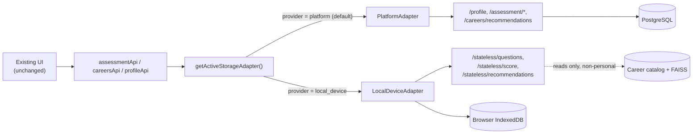

# Bring-Your-Own-Storage (BYOS) Architecture

> Status: **Phase 9a shipped.** This document describes what is built today.
> For the philosophy behind this direction, see [`docs/VISION.md`](../VISION.md).
> For what's planned next (cloud providers, local folder export), see
> [`docs/ROADMAP.md`](../ROADMAP.md).

## The problem this solves

By default, this platform stores a user's career profile and psychometric
assessment results in a conventional PostgreSQL database it operates. Phase
9 exists to give users a real alternative: choose where personal data
lives, rather than have it live on the platform's servers by default.

## Design principle

**Compute stays server-side. Personal data storage does not, unless the
user chooses the account-based option.**

Recommendation generation requires an embedding model and a FAISS
similarity search against the career catalog — that's too heavy to run in
a browser. So the backend still performs the computation. What changes is
*where the input and output of that computation are persisted*: instead of
reading a user's profile from a database row, the backend can accept it
directly in the request body, compute a result, and return it —
**without writing it anywhere.**

## The storage adapter pattern

The frontend defines a single interface, `StorageAdapter`
(`apps/frontend/src/features/storage/types/index.ts`), with methods like
`getProfile()`, `saveProfile()`, `startAssessment()`, `getRecommendations()`.

Two concrete implementations exist today:

| Adapter | Where data lives | How compute happens |
|---|---|---|
| `PlatformAdapter` | PostgreSQL (existing DB) | Existing DB-backed endpoints (`/profile`, `/assessment/*`, `/careers/recommendations`) |
| `LocalDeviceAdapter` | Browser IndexedDB, this device only | New stateless endpoints (`/stateless/*`) — compute only, no persistence |

A lightweight registry (`features/storage/adapters/registry.ts`) resolves
which adapter is active based on a single stored preference (`platform` or
`local_device`), defaulting to `platform`. The feature-level API modules
(`assessmentApi`, `careersApi`, `profileApi`) delegate to whichever adapter
is active — existing UI code (assessment flow, dashboard, careers page)
did not need to change at all.



## The stateless backend endpoints

Three new endpoints under `/api/v1/stateless/`, all requiring
authentication (an account is still needed) but touching no per-user
database table:

| Endpoint | Purpose |
|---|---|
| `GET /stateless/questions` | Returns the static question bank. Unlike `POST /assessment/start`, creates no database session row. |
| `POST /stateless/score` | Scores Likert responses using the same pure `score_responses()` function the DB-backed flow uses. Nothing is persisted. |
| `POST /stateless/recommendations` | Accepts psychometric scores and profile fields directly in the request body, runs the same FAISS + ranking + explainability pipeline, returns results. Only the shared career catalog is read from the database — never personal data. |

This is not a parallel, duplicated implementation. `RecommendationService`
was refactored to extract a shared core method, `recommend_from_data()`,
that both the existing DB-backed `get_recommendations()` and the new
stateless path call — there is exactly one recommendation pipeline, with
two different ways of supplying it the user's data.

## What "This Device" storage actually stores, and where

All of it lives in a single IndexedDB database (`cip_local_storage`) in the
user's browser:

- Profile fields (education, field, goals, etc.)
- Latest assessment results (dimension scores)
- A cached copy of the last recommendation result

None of it is sent to the backend for storage — only sent transiently, per
request, to the stateless endpoints for computation, then discarded
server-side.

## Honest trade-offs of "This Device" storage

These are stated plainly in the product UI (`StorageOnboarding.tsx`), not
buried:

- **No cross-device sync.** By definition — the data doesn't leave the
  device.
- **Clearing browser data erases it.** There is no backend copy to recover
  from.
- **No historical session list.** Local storage keeps only the *latest*
  assessment result, not a history of every session (the platform-backed
  option does support this via `GET /assessment/{session_id}/results`).
- **Export/import is not yet built.** This is explicitly Phase 9d on the
  roadmap — right now, switching away from "This Device" does not migrate
  data anywhere.

## Google Drive OAuth flow (Phase 9b backend broker — shipped)

The backend brokers the handshake but never stores the resulting tokens.
Five endpoints under `/storage/google-drive/*` (full request/response
detail in [`docs/api/reference.md`](../api/reference.md)) implement four
legs plus disconnect:

```
Browser                      Backend                        Google
  |--- GET /connect --------->|                                |
  |                           |-- stage ticket (Redis, 5m) --->|
  |<-- authorize_url ---------|                                |
  |------------------- navigate to authorize_url -------------->|
  |                                                    user approves
  |<----------------- 302 redirect w/ code, state=ticket --------|
  |--- GET /callback?code&state=ticket ->|                       |
  |                           |-- validate ticket, delete it     |
  |                           |-- POST /token (code) ----------->|
  |                           |<-- access+refresh tokens --------|
  |                           |-- stage exchange code (Redis,60s)|
  |<-- 302 to /settings?...&gdrive_exchange=<code> --------------|
  |--- POST /exchange {exchange_code} -->|                       |
  |                           |-- claim + delete (single-use)    |
  |<-- access_token, refresh_token, expires_at, scope -----------|
  |                    (browser stores tokens in IndexedDB;
  |                     talks to Drive REST API directly from here)
  |--- POST /refresh {refresh_token} --->|-- POST /token ------->|
  |<-- new access_token ------------------|<-- new access_token --|
  |--- POST /disconnect {token} --------->|-- POST /revoke ------>|
  |<-- { revoked: true } -----------------|                       |
```

Why two staged secrets instead of one: the **ticket** exists because the
browser's redirect to `/callback` carries no Authorization header, so the
backend needs some other way to know which user is connecting. The
**exchange code** exists so the tokens never travel through a URL query
string (which would leak into browser history and server access logs) —
they only ever cross the wire once, over an authenticated POST, and the
code is deleted immediately after being claimed.

Both are staged in Redis with short TTLs (5 min / 60s) and are the *only*
thing Redis is used for in this project — never personal data. Google
credentials (`GOOGLE_CLIENT_ID` / `GOOGLE_CLIENT_SECRET`) are required
backend configuration; endpoints that need them return 503 if unset.

**Not built yet in this phase:** the frontend `GoogleDriveAdapter.ts` that
ties this broker together with the raw Drive REST client into the
`StorageAdapter` interface, plus the connect/disconnect UI. Until that
lands, `google_drive` remains marked `"coming_soon"` in
`STORAGE_PROVIDERS` and isn't reachable from the Settings UI yet.

## What's explicitly not in this phase

- The `GoogleDriveAdapter.ts` frontend implementation, raw Drive REST
  client wiring, token storage helpers, and connect/disconnect UI — the
  backend broker above is done; this is what's left of Phase 9b.
- OneDrive, Dropbox backends — Phase 9c, same `StorageAdapter` interface,
  different concrete implementation with OAuth.
- Local folder export/import — Phase 9d.
- Wiring the storage choice into the registration/onboarding flow — for
  now, the choice lives in **Settings → Storage**, reachable after account
  creation. First-run integration is Phase 9e.
- Migrating existing platform-stored data into local storage, or vice
  versa, when a user switches providers.

## A note on a bug found and fixed along the way

While wiring `PlatformAdapter.startAssessment()`, a pre-existing mismatch
was found: the backend's question schema uses `prompt` / `reverse_scored`,
while the frontend's `AssessmentQuestion` type expects `text` / `reversed`
/ `options`. The original code cast the raw response directly to the
frontend type without mapping fields — TypeScript could not catch this
because the mismatch only manifests at runtime through an HTTP boundary.
This is now fixed with an explicit mapping function
(`mapRawQuestion` in `features/storage/api/stateless.api.ts`), shared by
both adapters. This was a genuine pre-existing bug, unrelated to BYOS,
found only because this work touched the same code path.
