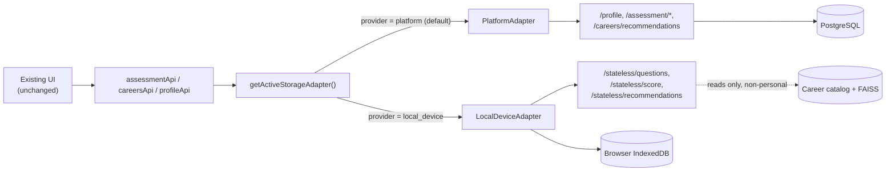

# Bring-Your-Own-Storage (BYOS) Architecture

> Status: **Phase 9a shipped.** This document describes what is built today.
> For the philosophy behind this direction, see [`docs/VISION.md`](../VISION.md).
> For what's planned next (cloud providers, local folder export), see
> [`docs/ROADMAP.md`](../ROADMAP.md).

## The problem this solves

By default, this platform stores a user's career profile and psychometric
assessment results in a conventional PostgreSQL database it operates. Phase
9 exists to give users a real alternative: choose where personal data
lives, rather than have it live on the platform's servers by default.

## Design principle

**Compute stays server-side. Personal data storage does not, unless the
user chooses the account-based option.**

Recommendation generation requires an embedding model and a FAISS
similarity search against the career catalog — that's too heavy to run in
a browser. So the backend still performs the computation. What changes is
*where the input and output of that computation are persisted*: instead of
reading a user's profile from a database row, the backend can accept it
directly in the request body, compute a result, and return it —
**without writing it anywhere.**

## The storage adapter pattern

The frontend defines a single interface, `StorageAdapter`
(`apps/frontend/src/features/storage/types/index.ts`), with methods like
`getProfile()`, `saveProfile()`, `startAssessment()`, `getRecommendations()`.

Two concrete implementations exist today:

| Adapter | Where data lives | How compute happens |
|---|---|---|
| `PlatformAdapter` | PostgreSQL (existing DB) | Existing DB-backed endpoints (`/profile`, `/assessment/*`, `/careers/recommendations`) |
| `LocalDeviceAdapter` | Browser IndexedDB, this device only | New stateless endpoints (`/stateless/*`) — compute only, no persistence |

A lightweight registry (`features/storage/adapters/registry.ts`) resolves
which adapter is active based on a single stored preference (`platform` or
`local_device`), defaulting to `platform`. The feature-level API modules
(`assessmentApi`, `careersApi`, `profileApi`) delegate to whichever adapter
is active — existing UI code (assessment flow, dashboard, careers page)
did not need to change at all.



## The stateless backend endpoints

Three new endpoints under `/api/v1/stateless/`, all requiring
authentication (an account is still needed) but touching no per-user
database table:

| Endpoint | Purpose |
|---|---|
| `GET /stateless/questions` | Returns the static question bank. Unlike `POST /assessment/start`, creates no database session row. |
| `POST /stateless/score` | Scores Likert responses using the same pure `score_responses()` function the DB-backed flow uses. Nothing is persisted. |
| `POST /stateless/recommendations` | Accepts psychometric scores and profile fields directly in the request body, runs the same FAISS + ranking + explainability pipeline, returns results. Only the shared career catalog is read from the database — never personal data. |

This is not a parallel, duplicated implementation. `RecommendationService`
was refactored to extract a shared core method, `recommend_from_data()`,
that both the existing DB-backed `get_recommendations()` and the new
stateless path call — there is exactly one recommendation pipeline, with
two different ways of supplying it the user's data.

## What "This Device" storage actually stores, and where

All of it lives in a single IndexedDB database (`cip_local_storage`) in the
user's browser:

- Profile fields (education, field, goals, etc.)
- Latest assessment results (dimension scores)
- A cached copy of the last recommendation result

None of it is sent to the backend for storage — only sent transiently, per
request, to the stateless endpoints for computation, then discarded
server-side.

## Honest trade-offs of "This Device" storage

These are stated plainly in the product UI (`StorageOnboarding.tsx`), not
buried:

- **No cross-device sync.** By definition — the data doesn't leave the
  device.
- **Clearing browser data erases it.** There is no backend copy to recover
  from.
- **No historical session list.** Local storage keeps only the *latest*
  assessment result, not a history of every session (the platform-backed
  option does support this via `GET /assessment/{session_id}/results`).
- **Export/import is not yet built.** This is explicitly Phase 9d on the
  roadmap — right now, switching away from "This Device" does not migrate
  data anywhere.

## Google Drive OAuth flow (Phase 9b backend broker — shipped)

The backend brokers the handshake but never stores the resulting tokens.
Five endpoints under `/storage/google-drive/*` (full request/response
detail in [`docs/api/reference.md`](../api/reference.md)) implement four
legs plus disconnect:

```
Browser                      Backend                        Google
  |--- GET /connect --------->|                                |
  |                           |-- stage ticket (Redis, 5m) --->|
  |<-- authorize_url ---------|                                |
  |------------------- navigate to authorize_url -------------->|
  |                                                    user approves
  |<----------------- 302 redirect w/ code, state=ticket --------|
  |--- GET /callback?code&state=ticket ->|                       |
  |                           |-- validate ticket, delete it     |
  |                           |-- POST /token (code) ----------->|
  |                           |<-- access+refresh tokens --------|
  |                           |-- stage exchange code (Redis,60s)|
  |<-- 302 to /settings?...&gdrive_exchange=<code> --------------|
  |--- POST /exchange {exchange_code} -->|                       |
  |                           |-- claim + delete (single-use)    |
  |<-- access_token, refresh_token, expires_at, scope -----------|
  |                    (browser stores tokens in IndexedDB;
  |                     talks to Drive REST API directly from here)
  |--- POST /refresh {refresh_token} --->|-- POST /token ------->|
  |<-- new access_token ------------------|<-- new access_token --|
  |--- POST /disconnect {token} --------->|-- POST /revoke ------>|
  |<-- { revoked: true } -----------------|                       |
```

Why two staged secrets instead of one: the **ticket** exists because the
browser's redirect to `/callback` carries no Authorization header, so the
backend needs some other way to know which user is connecting. The
**exchange code** exists so the tokens never travel through a URL query
string (which would leak into browser history and server access logs) —
they only ever cross the wire once, over an authenticated POST, and the
code is deleted immediately after being claimed.

Both are staged in Redis with short TTLs (5 min / 60s) and are the *only*
thing Redis is used for in this project — never personal data. Google
credentials (`GOOGLE_CLIENT_ID` / `GOOGLE_CLIENT_SECRET`) are required
backend configuration; endpoints that need them return 503 if unset.

**Frontend (also shipped):** `GoogleDriveAdapter.ts` ties this broker
together with the raw Drive REST client (`googleDriveClient.ts`) into the
`StorageAdapter` interface. `GoogleDriveConnect.tsx` (rendered in
Settings → Storage) drives the handshake: a "Connect Google Drive" button
kicks off the full-page redirect, and the component detects the
`gdrive_exchange`/`gdrive_error` params on the post-callback landing,
claims the tokens, and stores them via `googleDriveTokens.ts` (the same
IndexedDB store `LocalDeviceAdapter` uses, under a distinct key). Selecting
Google Drive from the provider picker itself is deliberately blocked
(`useStorageProvider.selectProvider` requires `fromConnectFlow: true`) —
there's no valid state where clicking the picker card alone should switch
the active provider, since no tokens exist until the connect flow
succeeds. `google_drive` is marked `"available"` in `STORAGE_PROVIDERS`,
but the picker shows a "Connect below ↓" badge instead of letting the
card itself switch providers.

Token refresh happens two ways: proactively (`GoogleDriveAdapter` checks
expiry with a 60-second skew before every Drive call) and reactively (one
retry via forced refresh if Drive itself returns 401 — covers the case
where the user revoked access directly from their Google account, outside
this app).

## OneDrive OAuth flow (Phase 9c backend broker — shipped)

Structurally identical to the Google Drive flow above — same
ticket/exchange staging in Redis, same reasoning for both secrets. Two
real differences worth knowing:

1. **Endpoint shapes.** Microsoft's v2.0 identity platform:
   `https://login.microsoftonline.com/{tenant}/oauth2/v2.0/authorize` and
   `.../token`, where `{tenant}` is `"common"` by default (accepts both
   personal Microsoft accounts and work/school Azure AD accounts —
   `MICROSOFT_OAUTH_TENANT` can be set to `"consumers"` to restrict to
   personal accounts only). The scope requested is
   `Files.ReadWrite.AppFolder offline_access` — the Microsoft Graph
   equivalent of Google's `drive.appdata`, a hidden per-app folder rather
   than the user's visible OneDrive.

2. **No disconnect leg.** Google's `/revoke` endpoint has no direct
   Microsoft equivalent for this OAuth flow — there's no simple "take a
   token, invalidate it" REST call to make. So there's no
   `/storage/onedrive/disconnect` endpoint and no `revoke_token()` method
   on `OneDriveOAuthService`. Disconnecting OneDrive is purely
   client-side: the frontend clears its stored tokens and simply stops
   calling the Graph API. A user who wants to fully revoke access needs
   to do that from their Microsoft account's app permissions page
   directly — this is documented in the setup guide, not hidden.

Both differences are consequences of using Microsoft's actual API
surface as it exists, not an attempt to make OneDrive look identical to
Google Drive where it isn't.

**Frontend (also shipped):** `OneDriveAdapter.ts` + `oneDriveClient.ts`
(the raw Graph REST client) + `oneDriveTokens.ts`, following the exact
same shape as the Google Drive frontend. One genuine simplification:
Graph addresses the app-folder data file directly by path
(`special/approot:/career-intelligence-data.json`), so there's no
separate "find the file's ID first" step the way Drive's client needs —
a `PUT` to the content endpoint both creates and overwrites. `OneDriveConnect.tsx`
mirrors `GoogleDriveConnect.tsx`'s connect flow exactly, but its disconnect
handler never calls the backend — it just clears local tokens, per the
missing-disconnect-endpoint design above.

`useStorageProvider.selectProvider`'s connect-flow guard (originally
written just for `google_drive`) was generalized to a
`PROVIDERS_REQUIRING_CONNECT_FLOW` set so both cloud providers share the
same guard rather than duplicating the special-case check per provider.

## Dropbox OAuth flow (Phase 9c — shipped, backend + frontend)

Same ticket/exchange staging as the other two providers. Closer to
Google Drive than OneDrive in one specific way: **Dropbox has a real
token-revoke endpoint** (`POST /2/auth/token/revoke`), so
`DropboxOAuthService` has a `revoke_token()` method and there's a
`/storage/dropbox/disconnect` endpoint — unlike OneDrive.

Two Dropbox-specific details:

1. **`token_access_type=offline`** must be passed at the authorize step
   to get a refresh token back at all — Dropbox defaults to issuing only
   short-lived access tokens otherwise.
2. **Revoke authenticates as the token being revoked**, not via a body
   parameter — the backend calls Dropbox's revoke endpoint with
   `Authorization: Bearer {access_token}` rather than passing the token
   in the request body the way Google's does. This means disconnect must
   be called with an access token specifically, not a refresh token.
3. Dropbox's "App folder" access type (configured once, when creating the
   app in the Dropbox App Console — not requested via OAuth scope) is
   what sandboxes this app to its own `Apps/<AppName>` folder, Dropbox's
   equivalent of Google's `appDataFolder` / Microsoft's `approot`.

**Frontend (also shipped):** `DropboxAdapter.ts` + `dropboxClient.ts` +
`dropboxTokens.ts`, same shape as the other two cloud adapters.
`DropboxConnect.tsx` mirrors `GoogleDriveConnect.tsx` exactly, including a
real backend disconnect call (unlike `OneDriveConnect.tsx`, which is
client-only) — Dropbox has a genuine revoke endpoint. Structurally,
`DropboxAdapter` is closer to `OneDriveAdapter` than `GoogleDriveAdapter`:
Dropbox's "App folder" access type means every path is already sandboxed
to the app, so there's no file-ID lookup step, same simplification Graph
gets from its path-addressable API.

`PROVIDERS_REQUIRING_CONNECT_FLOW` (the guard added when OneDrive
shipped) and `StorageOnboarding`'s `needsConnect` check both now cover all
three cloud providers.

This closes out the three-provider set for Phase 9c — Google Drive,
OneDrive, and Dropbox are all fully wired end-to-end (backend broker +
frontend adapter + connect UI), none of them smoke-tested against real
provider servers yet (see the honesty notes in `docs/ROADMAP.md` and
each `docs/setup/*.md` guide).

## Onboarding integration and provider-switching migration (Phase 9e — shipped)

Two things that were previously true and are no longer:

**The storage choice is now part of registration.** `useAuth.register()`
redirects to `/onboarding/storage` instead of straight to `/dashboard` —
a one-time detour, not a gate. The page renders the same picker and
connect panels as Settings → Storage, and its only action is "Continue
to Dashboard," which works identically whether or not anything was
changed from the default (`platform`). Logging in (as opposed to
registering) still goes straight to `/dashboard`; only a fresh signup
sees this page, and only once.

**Switching providers now actually moves data instead of stranding it.**
Every `StorageAdapter` gained two new methods:

```ts
exportSnapshot(): Promise<StorageSnapshot>;
restoreSnapshot(snapshot: StorageSnapshot): Promise<RestoreSnapshotResult>;
```

`useStorageProvider.selectProvider()` is now async: before flipping the
active provider, it calls `migrateStorageData()`
(`features/storage/lib/migrateProviderData.ts`), which exports a
snapshot from the current adapter and restores it into the target one.
`RestoreSnapshotResult` reports what actually happened
(`profileRestored`, `assessmentRestored`) rather than a single
success/fail flag, because it isn't always both — see below.

**`StorageSnapshot` deliberately excludes recommendations.** They're a
derived cache with no independent value — trivially recomputable from
the assessment via `getRecommendations()` — and none of the five
adapters expose a raw "read the cached value without recomputing"
getter. Adding one to all five purely to save a single backend
round-trip after a rare, deliberate action wasn't worth the surface
area.

**One real, one-directional gap: migrating an assessment *into* platform
storage isn't possible.** The backend has no endpoint to set a
precomputed assessment result directly — only `/assessment/start` +
`/assessment/submit`, which take raw Likert responses (never retained,
only their computed scores) and always run a fresh scoring pass. So
`PlatformAdapter.restoreSnapshot()` restores the profile fine but always
reports `assessmentRestored: false`. Every other direction (platform →
any BYOS adapter, BYOS → BYOS) restores both fully. The onboarding page
and Settings' provider picker both surface this honestly via
`describeMigration()` ("Your profile moved, but your assessment
couldn't be — you'll need to retake it here.") rather than silently
losing data or claiming a migration that didn't fully happen.

**Migration is defensive against the disconnect flow.** The three
`*Connect.tsx` disconnect handlers clear stored tokens *before* calling
`selectProvider("platform")` (so a failed revoke call never leaves the
UI showing "connected" with dead tokens) — which means the source
adapter is already inaccessible by the time migration would try to read
from it. `migrateStorageData()` catches that and reports
`attempted: false` rather than throwing and breaking the disconnect
button.

## Manual export/import (Phase 9d — shipped)

`docs/ROADMAP.md` describes this phase as "manual export-to-file and
import-from-file support" — and that's exactly what shipped, not a sixth
`StorageAdapter`. Two design decisions worth being explicit about:

**`local_folder` stays `coming_soon`.** The alternative — a true live
"Local Folder" adapter backed by the browser's File System Access API
(`showDirectoryPicker()`) — was considered and deliberately not built:
it's Chromium-only (no Firefox/Safari support), and directory-handle
permissions don't reliably persist across sessions, so a "connected"
folder adapter would silently re-prompt or fail on reload in ways the
other four adapters never do. Shipping that as a sixth peer to Google
Drive/OneDrive/Dropbox would have meant a materially less reliable
experience wearing the same UI as adapters that don't have this problem.
`local_folder`'s `STORAGE_PROVIDERS` entry is unchanged — still marked
`coming_soon` — because nothing here makes it selectable as an active
provider.

**Export/import is built entirely on Phase 9e's snapshot primitives.**
`buildExportFile()` calls whichever adapter is currently active's
`exportSnapshot()` and wraps it in a small versioned envelope
(`format_version`, `exported_at`, `exported_from`) before triggering a
browser download. Import does the reverse: parse and structurally
validate the file (`parseImportFile()` — shallow validation only; a
malformed inner shape surfaces as a clear failure from the adapter's
own `restoreSnapshot()` rather than being caught twice), confirm with
the user since it overwrites current data (same two-step
Cancel/confirm pattern as `DangerZone.tsx` and the local-device
"Clear data" section, not a native `window.confirm()`), then call
`restoreSnapshot()` on the active adapter. Same one-directional gap
as migration: importing into platform storage restores the profile but
never the assessment (`describeImportResult()`, wording distinct from
`migrateProviderData.ts`'s `describeMigration()` since "restored from a
file you picked" reads differently than "moved when you switched
providers," even though both wrap the same `RestoreSnapshotResult`).

## What's explicitly not in this phase

- Real-credential end-to-end testing for any of the three cloud providers
  — see the setup guides under `docs/setup/` and the honesty note in
  `docs/ROADMAP.md`. Still the single biggest open gap in the whole BYOS
  effort.
- A "clear my cloud data" affordance in Settings — all three cloud
  adapters implement `clearAll()` for interface completeness, but the
  Settings UI's "clear data" section is still local-device-only; wiring
  it up for the cloud providers too is a small follow-up, not done here
  to avoid scope creep beyond what was asked.
- A backend endpoint to set a precomputed assessment result directly —
  would close the platform-restore gap above, but is real backend work,
  not something the frontend migration/import layer can work around.
- Any UI for reviewing *before* a migration or import happens (e.g.
  "here's what will change, confirm?" beyond the destructive-overwrite
  warning import already has) — both currently just report what
  happened after the fact via a status message.
- A true live "Local Folder" adapter — see above; not ruled out forever,
  just not what "Phase 9d" turned out to mean once the File System
  Access API's real constraints were weighed against it.

## A note on a bug found and fixed along the way

While wiring `PlatformAdapter.startAssessment()`, a pre-existing mismatch
was found: the backend's question schema uses `prompt` / `reverse_scored`,
while the frontend's `AssessmentQuestion` type expects `text` / `reversed`
/ `options`. The original code cast the raw response directly to the
frontend type without mapping fields — TypeScript could not catch this
because the mismatch only manifests at runtime through an HTTP boundary.
This is now fixed with an explicit mapping function
(`mapRawQuestion` in `features/storage/api/stateless.api.ts`), shared by
both adapters. This was a genuine pre-existing bug, unrelated to BYOS,
found only because this work touched the same code path.
