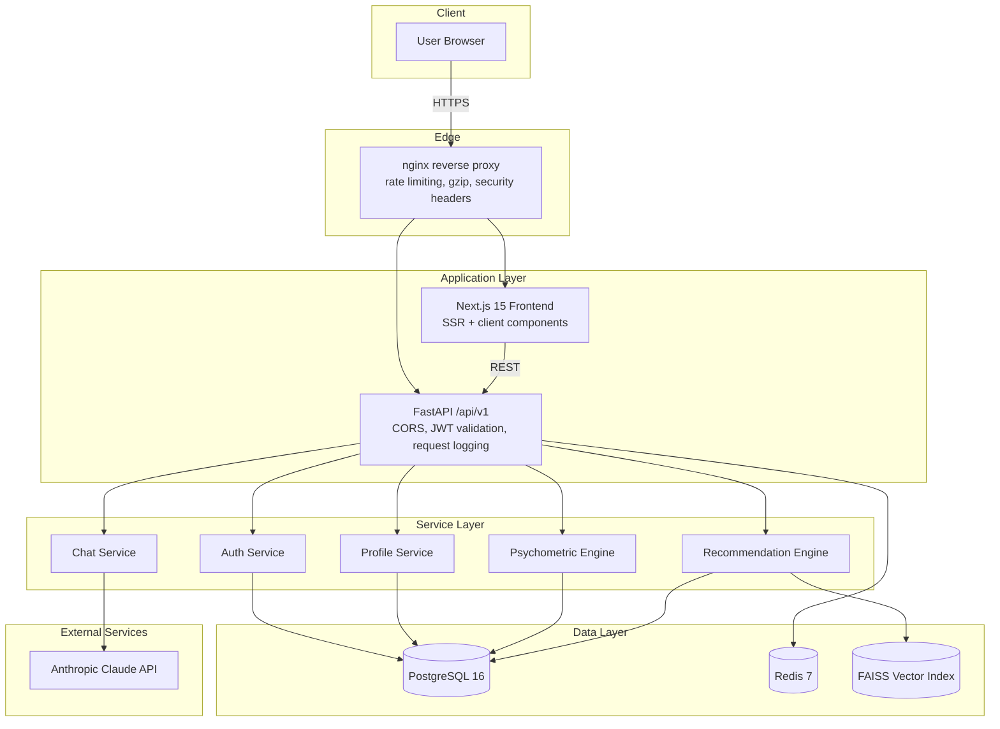

# System Architecture Overview

> This document describes the **current** architecture. For planned changes —
> particularly the move to a bring-your-own-storage data model — see
> [`docs/ROADMAP.md`](../ROADMAP.md).

## High-level diagram

## Service responsibilities

### Authentication Service

Issues and validates JWTs using HS256. Manages refresh token rotation with
revocation support. Enforces role-based access control on protected routes.
Passwords are hashed with Argon2id.

### Profile Service

Stores user biographical and career-preference data (education, field,
experience, goals). Computes a weighted profile completeness score that
updates live as fields are filled in. Triggers profile embedding
regeneration when relevant fields change.

### Psychometric Engine

Scores Big Five personality dimensions and RIASEC vocational interest
dimensions from a structured question bank. Produces normalized 0–100
scores per dimension with a confidence value per assessment session.

### Recommendation Engine

Builds a natural-language profile summary and embeds it with
`sentence-transformers/all-MiniLM-L6-v2`. Runs a FAISS `IndexFlatIP`
similarity search against pre-computed career embeddings. Re-ranks
candidates with a weighted composite of semantic similarity, RIASEC
alignment, salary competitiveness, and market outlook. Produces a
per-factor explanation and confidence band for every recommendation.

### Chat Service

Loads the user's profile and latest psychometric scores to build a
personalized system prompt, then calls the Anthropic Claude API. Stateless
on the backend — conversation history is supplied by the client on each
request. Degrades gracefully (HTTP 503) when no API key is configured.

### Career Ontology

Career records are seeded from a curated O*NET occupational taxonomy
subset, including RIASEC interest weights, median salary, and job-growth
outlook percentile per occupation. See `apps/backend/src/scripts/load_onet.py`.

## Recommendation data flow

1. User completes the psychometric assessment.
2. The Psychometric Engine scores responses into normalized per-dimension
   values (0–100).
3. The Recommendation Engine builds a profile summary and generates an
   embedding vector.
4. FAISS returns the top-N most similar careers by cosine similarity.
5. The ranker re-scores candidates using the composite weighting described
   above.
6. The explainability engine decomposes each ranked result into per-factor
   scores and a plain-language summary.
7. Results are returned to the client; the frontend renders ranked cards
   with expandable factor breakdowns.

## Security architecture

| Concern | Mitigation |
|---|---|
| Password storage | Argon2id hashing |
| Session/token integrity | JWT signed with HS256, short-lived access tokens, rotating refresh tokens |
| Abuse / brute force | Per-IP and per-user rate limiting (nginx + application layer) |
| Cross-origin requests | CORS restricted to explicitly configured origins |
| SQL injection | SQLAlchemy parameterized queries exclusively — no raw string interpolation |
| XSS | Content-Security-Policy and related security headers on all responses |
| Data in transit | HTTPS terminated at the reverse proxy in production |

See [`SECURITY.md`](../../SECURITY.md) for the vulnerability disclosure process.

## A note on data ownership

The architecture described above stores user profile and assessment data
in a conventional, platform-operated PostgreSQL database. This is the
current state, not the intended end state — see the **Bring-Your-Own-Storage**
section of [`docs/ROADMAP.md`](../ROADMAP.md) for the planned shift toward a
model where the platform does not retain a copy of personal data on its own
servers.
